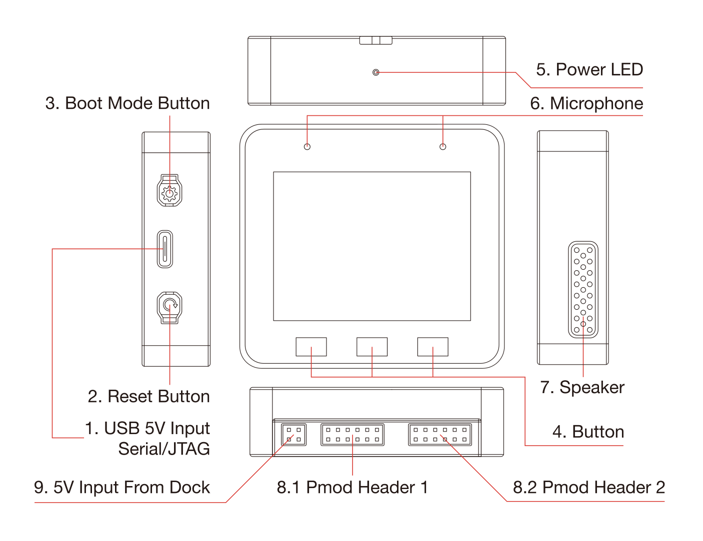
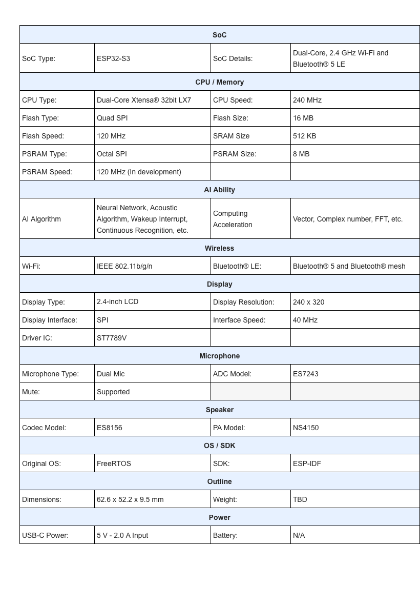
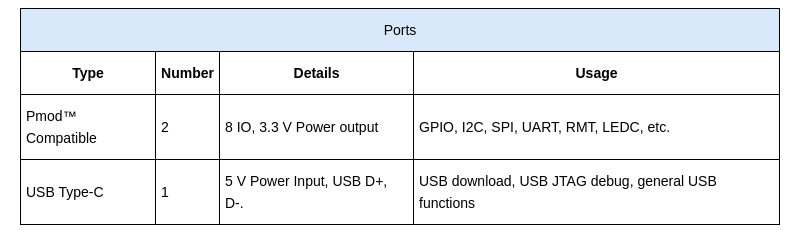

ESP32-S3-BOX-Lite
=================

* `中文版本 <./hardware_overview_for_lite_cn.md>`__

Hardware Overview
-----------------

   esp_box_hardware

Hardware Source Files
^^^^^^^^^^^^^^^^^^^^^

* `ESP32-S3-BOX-Lite Mainboard Schematic <../../../hardware/esp32_s3_box_lite_MB_V1.1/schematic>`__
* `ESP32-S3-BOX-Lite Mainboard PCB <../../../hardware/esp32_s3_box_lite_MB_V1.1/pcb>`__
* `ESP32-S3-BOX-Lite Mainboard Gerber <../../../hardware/esp32_s3_box_lite_MB_V1.1/gerber>`__
* `ESP32-S3-BOX-Lite Subboard Schematic <../../../hardware/esp32_s3_box_lite_MIC_V1.0/schematic>`__
* `ESP32-S3-BOX-Lite Subboard PCB <../../../hardware/esp32_s3_box_lite_MIC_V1.0/pcb>`__
* `ESP32-S3-BOX-Lite Subboard Gerber <../../../hardware/esp32_s3_box_lite_MIC_V1.0/gerber>`__
* `ESP32-S3-BOX-Lite Shell CAD STEP <../../../hardware/esp32_s3_box_lite_shell_step>`__

Specifications:
^^^^^^^^^^^^^^^

   specs

Ports:
^^^^^^

   ports

* `Digilent Pmod™ Interface Specification <https://digilent.com/reference/_media/reference/pmod/pmod-interface-specification-1_3_1.pdf>`__
