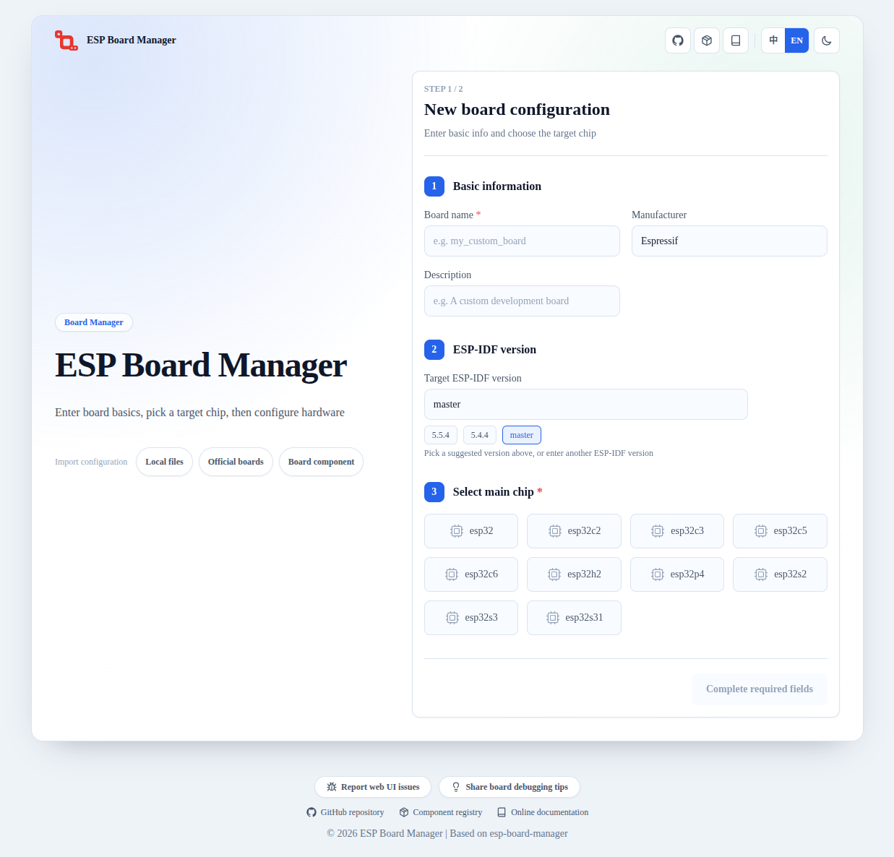

ESP Board Manager Web Configurator
========================================

:link_to_translation:`zh_CN:[中文]`

The ESP Board Manager Web Configurator generates Board Manager board-level YAML files in the browser. It suits cases where you are not familiar with the YAML fields and prefer to organize board configuration through a graphical interface. The tool runs entirely in the frontend and does not depend on ESP-IDF, Python, or a backend service; the device and peripheral libraries come from bundled static descriptor data.

The tool supports creating new board configurations, importing existing configurations, editing device and peripheral parameters, and exporting board files. For the step-by-step workflow, see :doc:`/create-board/web-create`.

Web Link
----------------

ESP Board Manager Web Configurator (https://board-manager.espressif.com)

   ESP Board Manager Web Configurator main view.

Main Features
----------------

- **Create a new board configuration**: fill in the board name, manufacturer, description, target ESP-IDF version, and main chip, then select the required devices and peripherals.
- **Import an existing configuration**: import a local board directory, an official board, or a board component and continue editing from that starting point.
- **Edit configuration parameters**: fill in mode fields, pin parameters, to-be-confirmed parameters, peripheral bindings, and component dependencies through configuration cards.
- **Export board files**: export ``board_info.yaml``, ``board_devices.yaml``, and ``board_peripherals.yaml``; ``setup_device.c`` is included when board-level initialization logic is required.
- **Validate configuration**: detect chip capability conflicts and warn about IO pin reuse before export.

Scope
----------------

The Web Configurator is intended for BMGR-supported device and peripheral types, and works well as an entry point for creating a new board configuration. After configuration, it can export the following files in one step:

- ``board_info.yaml``
- ``board_devices.yaml``
- ``board_peripherals.yaml``
- ``setup_device.c``

``setup_device.c`` is generated only when a selected device needs board-level initialization logic that pure YAML cannot describe, such as a display factory function.

Boundaries
----------------

- The tool only generates board-level configuration files and does not replace the ``idf.py bmgr`` command. The exported YAML still needs to be placed in a project and processed by ``idf.py bmgr -b`` to generate board-level code.
- The tool does not generate ``sdkconfig.defaults.board``; the target chip and project configuration still need to be set in the ESP-IDF project as usual.
- The exported ``setup_device.c`` is only a code template generated against the factory function interface. Complete the initialization logic against the actual hardware and debug it on the board before use.
- Pin numbers, addresses, clocks, timing, and power relationships still need to be confirmed against the schematic and device datasheets.

Feedback Entries
----------------

The home page footer provides two feedback entries:

- **Report a web usage issue**: report problems with the Web Configurator itself, at https://board-manager.espressif.com/debug-collector/feedback .
- **Share board debugging experience**: submit experience gathered during board adaptation and debugging, at https://board-manager.espressif.com/debug-collector/board-tips .
