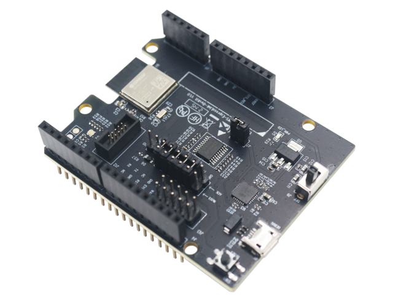
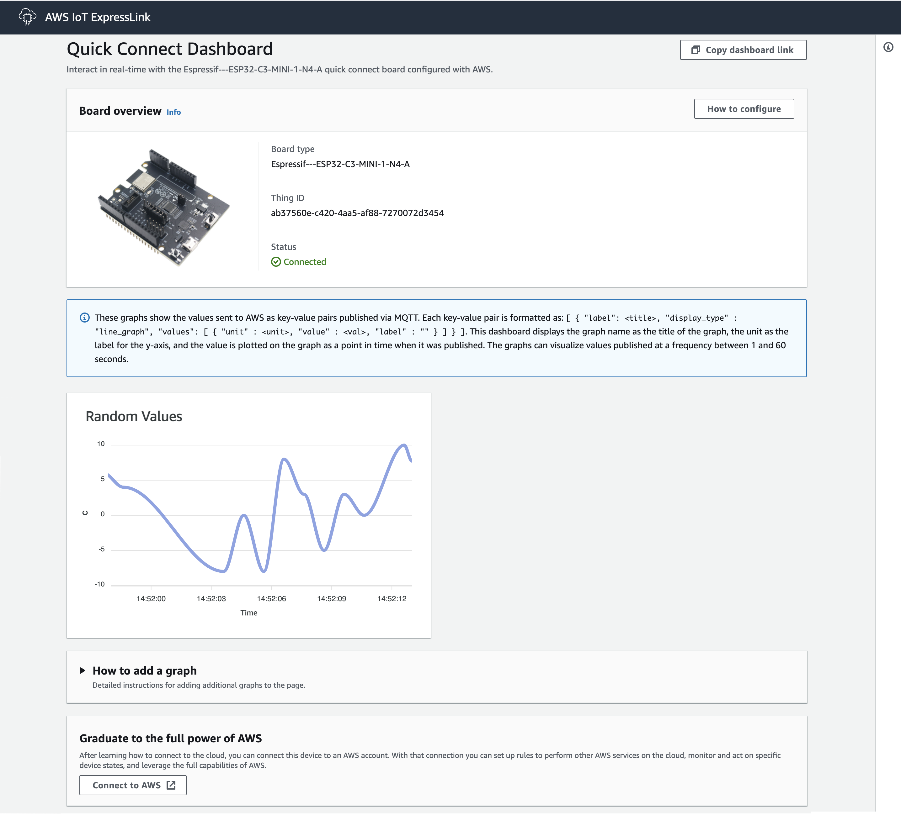

ESP32-C3-AWS-ExpressLink-DevKit
===============================

:link_to_translation:`en:[English]`

.. note::

   **重要提示**\ ：ExpressLink 固件版本只能烧录到 ExpressLink 模组和开发板。

目录
----

1. `文档信息 <#1-document-information>`__
2. `概述 <#2-overview>`__
3. `硬件说明 <#3-hardware-description>`__
4. `运行 Quick Connect 演示应用 <#4-run-the-quick-connect-demo-application>`__
5. `设置 AWS 账户和 IoT 开发权限 <#5-setup-your-aws-account-and-permissions-for-iot-development>`__
6. `将 ExpressLink 注册到开发账户 <#6-registering-expresslink-to-your-development-account>`__
7. `连接并与 AWS 云交互 <#7-connecting-and-interacting-with-aws-cloud>`__
8. `在 Arduino 草图中使用 ExpressLink <#8-using-expresslink-with-the-arduino-sketch>`__
9. `升级 ExpressLink 固件 <#9-upgrading-expresslink-firmware>`__
10. `故障排除 <#10-troubleshooting>`__

1. 文档信息
--------------------------------------------------

1.1 修订历史（版本、日期、变更说明）
^^^^^^^^^^^^^^^^^^^^^^^^^^^^^^^^^^^^^

1.0 2021 年 11 月 29 日 初始草稿  
1.1 2022 年 6 月 20 日 修订快速入门指南，扩展 CONFMODE，补充 Quick Connect 演示步骤并改进 OTA 步骤

2. 概述
--------------------------------------------------

   乐鑫 AWS IoT ExpressLink 评估套件

乐鑫 AWS IoT ExpressLink（下文简称 ExpressLink）是一款连接模组，通过串行接口（UART）连接主机，并使用抽象的应用程序编程接口（API）将任意主机应用连接到 AWS IoT Core 及其服务。
ExpressLink 模组将身份验证、设备管理、网络连接和消息传输等复杂且通用的工作负载从应用（主机）处理器中卸载。
该方案支持数百万嵌入式应用规模化迁移到云连接应用，并缩短产品上市时间。
更多 AWS IoT ExpressLink 信息请参阅 `此处 <https://aws.amazon.com/iot-expresslink/>`__。
开发者文档请参阅 `此处 <https://docs.aws.amazon.com/iot-expresslink>`__。
AWS IoT ExpressLink 示例请参阅 `此处 <https://github.com/aws/iot-expresslink>`__。

.. note::

   **注意**\ ：运行 `第 4 节 <#4-run-the-quick-connect-demo-application>`__ 的 Quick Connect 演示应用或本指南中的其他示例前，请按照 `第 9 节 <#9-upgrading-expresslink-firmware>`__ 将 ExpressLink 模组升级到最新版本。

.. note::

   OTW 升级所需的准备步骤较少，建议在评估期间首次升级时使用该方式。

3. 硬件说明
--------------------------------------------------

乐鑫 AWS IoT ExpressLink 开发板（ESP32-C3-AWS-ExpressLink-DevKit，下文简称 ExpressLink 开发板）采用 Arduino Shield 外形，可直接插在标准 Arduino 开发板上。
该开发板也可以与 Raspberry Pi 或其他主机配合使用。
要使用开发板的全部功能，需要连接以下引脚：

.. list-table::
   :header-rows: 1

   * - ExpressLink 引脚
     - ESP32-C3 GPIO 引脚
     - ESP32-C3-MINI-1-N4-A 模组引脚
   * - TX
     - IO19
     - 27
   * - RX
     - IO18
     - 26
   * - EVENT
     - IO10
     - 16
   * - WAKE
     - IO3
     - 6
   * - RESET
     - EN
     - 8

**注意**\ ：ExpressLink 模组与 AWS 云之间的通信在传输过程中（使用 TLS 1.2 协议）和静态存储时均已加密，但主机处理器与模组之间的串行接口（UART）未加密。如果需要在 ExpressLink 模组之间传输敏感数据，且存在设备被未授权人员物理控制的可能，建议主机处理器和对应的云应用实现适当的端到端消息加密方案。

3.1 数据手册
^^^^^^^^^^^^

乐鑫 AWS IoT ExpressLink 开发板基于 ESP32-C3-MINI-1-N4-A。
数据手册请参阅 `此处 <https://www.espressif.com/sites/default/files/documentation/esp32-c3-mini-1_datasheet_en.pdf>`__。

3.2 标准套件内容
^^^^^^^^^^^^^^^^

* 一块乐鑫 AWS IoT ExpressLink 开发板。

3.3 用户需准备的物品
^^^^^^^^^^^^^^^^^^^^

* Arduino 或 Raspberry Pi
* 任意开发主机

还可能需要以下物品：

* MicroUSB 数据线，例如 `此型号 <https://www.amazon.com/AmazonBasics-Male-Micro-Cable-Black/dp/B0711PVX6Z/>`__。
* 跳线，例如 `此型号 <https://www.amazon.com/Elegoo-EL-CP-004-Multicolored-Breadboard-arduino/dp/B01EV70C78/>`__。
* USB TTL 转换器，例如 `此型号 <https://www.amazon.com/Adapter-Serial-Converter-Development-Projects/dp/B075N82CDL/>`__。

3.4 可购买的第三方物品
^^^^^^^^^^^^^^^^^^^^^^

`Arduino 购买链接 <https://store-usa.arduino.cc/collections/boards/products/arduino-uno-rev3>`__
`Raspberry Pi 购买链接 <https://www.raspberrypi.com/products/>`__

3.5 其他硬件参考
^^^^^^^^^^^^^^^^

更多硬件信息请参阅 `ESP32-C3 硬件参考 <https://docs.espressif.com/projects/esp-idf/en/latest/esp32c3/hw-reference/esp32c3/user-guide-devkitm-1.html#hardware-reference>`__。

3.6 硬件连接
^^^^^^^^^^^^

3.6.1 与 Arduino 配合使用
^^^^^^^^^^^^^^^^^^^^^^^^^^^^^^^^^^^^^^^^^^^^^^^^^^

1. 如果 Arduino 开发板支持 Shield，则无需额外设置即可使用 ExpressLink 开发板。
2. 将 ExpressLink 开发板直接插到 Arduino 开发板的排针上。
3. 完成连接后，确认 ExpressLink 开发板的开关处于 OFF 状态。
4. 将 Arduino 连接到电脑，开发板会自动上电。
5. 按照 `第 8 节 <#8-using-expresslink-with-the-arduino-sketch>`__ 中的 Arduino 草图操作即可快速开始。

ExpressLink 开发板引脚与 Arduino 的映射如下：

.. list-table::
   :header-rows: 1

   * - ExpressLink 引脚
     - Arduino 引脚
   * - RESET
     - 4
   * - WAKE
     - 3
   * - EVENT
     - 2
   * - RX
     - 1
   * - TX
     - 0
   * - IOREF
     - IOREF
   * - GND
     - GND

3.6.2 与 Raspberry Pi 配合使用
^^^^^^^^^^^^^^^^^^^^^^^^^^^^^^^^^^^^^^^^^^^^^^^^^^

1. 将 ExpressLink 开发板连接到 Raspberry Pi 时，使用双母头跳线，将开发板 J13 连接器上的 TX、RX、EVENT、WAKE 和 RESET 公头引脚连接到 Raspberry Pi 的以下 GPIO 引脚：

.. list-table::
   :header-rows: 1

   * - ExpressLink 引脚
     - Raspberry Pi GPIO
   * - RESET
     - GPIO 4
   * - WAKE
     - GPIO 27
   * - EVENT
     - GPIO 22
   * - RX
     - GPIO 15
   * - TX
     - GPIO 14
   * - IOREF
     - 3V3 Power
   * - GND
     - GND

2. 在 Raspberry Pi 上使用终端应用访问 `/dev/ttyS0`，串口设置参见第 3.7 节中的表格。

3.6.3 与任意开发主机配合使用
^^^^^^^^^^^^^^^^^^^^^^^^^^^^^^^

ExpressLink 开发板可通过 USB 串行接口（使用 USB 至 TTL 转换器）连接任意开发主机，并使用简单的 AT 命令控制 ExpressLink。

.. list-table::
   :header-rows: 1

   * - ExpressLink 引脚
     - USB 至 TTL 转换器
   * - RX
     - TX
   * - TX
     - RX
   * - GND
     - GND

.. note::

   此连接方式无法使用 WAKE 和 EVENT 等附加功能，但适合快速评估开发板并了解命令行为。

3.7 设置主机
^^^^^^^^^^^^^^^^^^^^^^^

要在主机与 ExpressLink 之间建立串行连接，请打开终端应用（例如 Windows 的 TeraTerm 或 Mac 的 CoolTerm），选择评估套件对应的端口，并按以下参数配置：

.. list-table::
   :header-rows: 1

   * - 配置项
     - 值
   * - 波特率
     - 115200
   * - 数据位
     - 8
   * - 校验位
     - None
   * - 停止位
     - 1
   * - 流控
     - None
   * - 本地回显
     - Yes

快速检查时，在终端窗口输入 **AT** 并按回车。如果收到 **OK**\ ，表示评估套件已成功连接到主机。

.. note::

   **仅**\ 使用步骤 6a 中的连接无法操作 ExpressLink 开发板，也无法在显示启动日志的控制台中输入 AT 命令。使用 Raspberry Pi 或 Arduino 以外的主机时，还需按照第 3.6.2 和 3.6.3 节完成额外连接。

请保持终端窗口打开，后续步骤仍需使用。

4. 运行 Quick Connect 演示应用
-----------------------------------------

Quick Connect 演示应用可在几分钟内建立 AWS IoT 连接，无需安装依赖、下载和构建源代码，也无需 AWS 账户。

.. note::

   **注意**\ ：本演示适用于运行 ExpressLink 固件 v1.X.X 或更高版本的开发板。

请按以下步骤运行演示：

1. 如果上一步打开了终端应用，请先断开其与串口的连接。
2. 下载 Quick Connect 可执行文件：

   * `Mac 下载 <https://quickconnectexpresslinkutility.s3.us-west-2.amazonaws.com/QuickConnect_v1.9_macos.x64.tar.gz>`__
   * `Windows 下载 <https://quickconnectexpresslinkutility.s3.us-west-2.amazonaws.com/QuickConnect_v1.9_windows.x64.zip>`__
   * `Linux 下载 <https://quickconnectexpresslinkutility.s3.us-west-2.amazonaws.com/QuickConnect_v1.9_linux.x64.tar.gz>`__

3. 解压软件包，打开其中的 `config.txt`，在串口字段中填入评估套件对应的串口，例如 `COM14` 或 `/dev/cu.usbserial-12345`。
4. 在 SSID 和 Passphrase 字段中输入 Wi-Fi 凭据。
5. 运行 `Start_Quick_Connect` 可执行文件。

演示应用会连接 AWS IoT，并提供一个 URL。通过 **AT+SEND** 命令可在该页面查看设备向云端发送的数据。演示最多运行两分钟，之后可自行输入 **AT+SEND** 命令，并在可视化页面查看数据。

   乐鑫 ExpressLink QuickConnect 可视化页面截图

5. 设置 AWS 账户和 IoT 开发权限
-------------------------------

请参考 `设置 AWS 账户 <https://docs.aws.amazon.com/iot/latest/developerguide/setting-up.html>`__ 中的说明，完成以下步骤以创建账户和用户：

* 注册 AWS 账户。
* 创建用户并授予权限。
* 打开 AWS IoT 控制台。

请仔细阅读页面中的注意事项。

6. 将 ExpressLink 注册到开发账户
---------------------------------

要创建 IoT _Thing_ 并将其添加到账户，需要获取 ExpressLink 模块的 Thing Name 及对应证书。
步骤 6a 和 6b 提供了两种获取证书的方法。

6a. 将 ExpressLink 开发板直接连接到电脑
^^^^^^^^^^^^^^^^^^^^^^^^^^^^^^^^^^^^^^^

1. 断开 ExpressLink 开发板上的其他连接。
2. 使用 microUSB 至 USB 线缆，通过开发板上的 microUSB 接口将其连接到电脑。
3. 打开主机上的终端应用，选择开发板的 UART 端口，并将波特率设置为 115200。
4. 按下开发板上的 Reset 按键，确认可以看到启动日志。
5. 启动日志末尾会显示设备证书和 Thing Name。
6. 记录 Thing Name，并复制从 `-----BEGIN CERTIFICATE-----` 到 `-----END CERTIFICATE-----` 的证书内容，保存为 `ThingName.cert.pem` 文件。

6b. 使用 AT 命令获取证书和 Thing Name
^^^^^^^^^^^^^^^^^^^^^^^^^^^^^^^^^^^^^^

1. 在桌面终端应用中输入命令：\ **AT+CONF? ThingName**\ 。
2. 记录终端返回的字符串（由字母和数字组成）。
3. 在桌面终端应用中输入命令：\ **AT+CONF? Certificate pem**\ 。
4. 复制终端返回的证书字符串，并在主机上保存为 `ThingName.cert.pem` 文件。

6c. 在 AWS IoT 控制台中完成设置
^^^^^^^^^^^^^^^^^^^^^^^^^^^^^^^

1. 打开 `AWS IoT 控制台 <http://console.aws.amazon.com/iot>`__，依次选择 **Manage**\ 、\ **Things**\ 、\ **Create things**\ 、\ **Create single thing**\ ，然后单击 **Next**\ 。
2. 在 **Specify thing properties** 页面，将步骤 6a 或 6b 中记录的 Thing Name 填入 **Thing properties** 下的 **Thing name**\ 。其他字段保持默认值，然后单击 **Next**\ 。
3. 在 **Configure device certificate** 页面选择 **Use my certificate**\ ，并选择 **CA is not registered with AWS IoT**\ 。
4. 在 **Certificate** 下选择 **Choose file**\ ，双击步骤 6a 或 6b 中生成的 `ThingName.cert.pem` 文件。
5. 在 **Certificate Status** 下选择 **Active**\ 。
6. 单击 **Next**\ ，进入 **Attach policies to certificate**\ 。
7. 在 **Secure** 下选择 **Policies**\ 。
8. 单击 **Create** 创建策略，输入策略名称（例如 `IoTDevPolicy`），然后单击 **Advanced mode**\ 。
9. 将以下内容复制到控制台。

.. code-block:: json

   { "Version": "2012-10-17", "Statement": [{ "Effect": "Allow", "Action": "*", "Resource": "*" }] }

.. note::

   本文示例仅适用于开发环境。设备群组中的每台设备都必须使用仅允许访问指定资源和执行指定操作的凭据。具体权限策略取决于应用场景，请根据业务和安全要求制定策略。更多信息请参阅 AWS 的示例策略和安全最佳实践。

单击 **Save** 完成 Thing 创建。

1. 在 AWS IoT 控制台中选择 **Settings**\ ，在 **Device data endpoint** 下复制账户的 _Endpoint_ 字符串。
2. 在桌面终端应用中输入命令：\ **AT+CONF Endpoint=**\ 。

6.1 Wi-Fi 设置
^^^^^^^^^^^^^^

ExpressLink 开发板需要连接本地 Wi-Fi 路由器才能访问互联网。可以使用步骤 6.1.1 或 6.1.2 中的方法配置安全凭据。

.. note::

   如果尚未配置 Wi-Fi，开发板默认尝试连接 SSID **ESP-ExpressLink-Demo**\ ，密码为 **ExpressLink@12345**\ 。

6.1.1 使用 CONFMODE
^^^^^^^^^^^^^^^^^^^

1. 可以使用手机上的乐鑫开源配网应用配置 ExpressLink 开发板。Android 版本可从 Google Play 商店获取，iOS 和 iPadOS 版本可从 Apple App Store 获取。

`Google Play 商店 <https://play.google.com/store/apps/details?id=com.espressif.provble>`__

`Apple App Store <https://apps.apple.com/app/esp-ble-provisioning/id1473590141>`__

两个应用均为开源项目，源代码托管在 GitHub：

`GitHub 上的 Android 配网应用 <https://github.com/espressif/esp-idf-provisioning-android>`__

`GitHub 上的 iOS/iPadOS 配网应用 <https://github.com/espressif/esp-idf-provisioning-ios>`__

2. 在桌面终端应用中输入命令：\ **AT+CONFMODE**\ 。主机会返回 ``OK CONFMODE ENABLED``。

.. note::

   默认 BLE 设备名称为 ``PROV_XXXXXX``，其中 ``XXXXXX`` 是 ExpressLink MAC 地址最后 3 个字节的十六进制表示，不设置 PoP（Proof-of-Possession）。

   也可以使用命令 ``AT+CONFMODE`` 指定 BLE 设备名称和 PoP 值。

   BLE 设备名称最多 29 个字符，超出部分会被截断，且不能包含逗号。PoP 长度受 AT 命令最大长度（5000 个字符）限制，开头的空格会被忽略。

   配网过程的技术信息请参阅 `ESP-IDF 配网文档 <https://docs.espressif.com/projects/esp-idf/en/latest/esp32c3/api-reference/provisioning/provisioning.html>`__。

   CONFMODE 示例：

   .. list-table::
      :header-rows: 1

      * - ExpressLink AT 命令
        - BLE 设备名称
        - PoP 值
      * - AT+CONFMODE
        - PROV_XXXXXX
        - -
      * - AT+CONFMODE MyDevice, abcd1234
        - MyDevice
        - abcd1234
      * - AT+CONFMODE ,abcd1234
        - PROV_XXXXXX
        - abcd1234
      * - AT+CONFMODE MyDevice
        - MyDevice
        - -

3. 打开上一步安装的乐鑫配网应用，点击 **Provision Device**\ 。
4. 点击 **I don't have a QR code**\ 。
5. 应用会搜索活动的 BLE 设备。
6. 找到设备后点击其名称。

   如果设置了 PoP，请在选择设备后输入 PoP。

7. 应用会显示 ExpressLink 开发板检测到的 2.4 GHz Wi-Fi 网络。选择要连接的网络并输入凭据。
8. 凭据会发送到设备并保存。

6.1.2 使用 AT 命令
^^^^^^^^^^^^^^^^^^

1. 在桌面终端应用中输入命令：\ **AT+CONF SSID=**\ 。
2. 在桌面终端应用中输入命令：\ **AT+CONF Passphrase=**\ 。

.. note::

   本地路由器的 SSID 和密码会安全地存储在 ExpressLink 模块中。之后可以读取 SSID（例如用于调试），但读取密码会返回错误。

6.2 完成注册
^^^^^^^^^^^^

至此，评估套件已作为 Thing 注册到 IoT 账户。ExpressLink 模块会记住配置，下次连接时无需重复这些步骤，并会自动连接到 AWS 账户。

7. 连接并与 AWS 云交互
-----------------------

使用 AWS IoT 控制台中的 MQTT 客户端监控评估套件与 AWS 云之间的通信。

1. 打开 `AWS IoT 控制台 <https://console.aws.amazon.com/iot/>`__。
2. 在导航栏中选择 **Test**\ ，然后选择 **MQTT Test Client**\ 。
3. 在 ``Subscribe to a topic`` 中输入 ``#``，然后单击 **Subscribe**\ 。

7.1 建立连接
^^^^^^^^^^^^

输入命令 **AT+CONNECT** 建立安全连接。

稍后会收到消息 **OK 1 CONNECTED**\ ，表示已连接到 AWS 云账户。

7.2 向 AWS 云发送数据
^^^^^^^^^^^^^^^^^^^^^

要发送 ``Hello World!`` 消息，先输入命令 **AT+CONF Topic1=data**\ 。

模块会返回 **OK**\ 。然后输入 **AT+SEND1 Hello World!**\ ，稍后会再次收到 **OK**\ 。

在 AWS IoT 控制台的 ``data`` 主题下可以看到 ``Hello World!`` 消息。

7.3 接收云端数据和命令
^^^^^^^^^^^^^^^^^^^^^^^

要接收消息，先输入命令 **AT+CONF Topic1=MyTopic**\ 。模块会返回 **OK**\ 。

然后输入 **AT+SUBSCRIBE1**\ 。

在 AWS IoT 控制台的 MQTT 客户端中选择 **Publish to a topic**\ ，在 **Topic name** 中输入 **MyTopic**\ ，保留 **"Hello from the AWS IoT console"** 消息并单击 **Publish**\ 。

在终端中输入 **AT+GET1**\ ，模块会返回 **OK Hello from the AWS IoT console**\ 。

8. 在 Arduino 草图中使用 ExpressLink
-------------------------------------

仓库提供了基础草图 `sketches/arduino_sample_sketch.ino <sketches/arduino_sample_sketch.ino>`__，用于配合 Arduino 快速开始。

草图执行以下操作：

* 重置开发板并等待其就绪。
* 检查开发板是否已经完成配网（是否已有连接 Wi-Fi 所需的凭据），并设置硬编码的 Endpoint。
* 如果没有凭据，则进入 CONFMODE（使用方法参见第 6.1.1 节）。
* 完成配网后尝试连接 Wi-Fi 网络。
* 连接成功后，每 10 秒向 ``TEST`` 主题发送一次 ``Hello World``。

烧录草图前，将脚本中的硬编码 Endpoint 修改为步骤 6c 获取的 AWS IoT Endpoint。

按照 Arduino 的 `烧录说明 <https://www.arduino.cc/en/main/howto>`__ 将草图烧录到 Arduino 开发板。

.. note::

   此草图用于演示基本流程，也可以使用其他方式在 Arduino 上控制 ExpressLink 开发板。

8.1 Arduino 草图调试
^^^^^^^^^^^^^^^^^^^^

Arduino 的标准 RX 和 TX 引脚用于与 ExpressLink 开发板通信，因此 Arduino 的标准 USB 接口不能用于日志输出和调试。可以使用 Arduino 的其他 UART，步骤如下：

1. 调试 Arduino 草图需要 USB 至 TTL 转换器（购买链接见第 3.3 节）。
2. 按下表连接 Arduino（通过 ExpressLink 开发板）与 USB 至 TTL 转换器：

.. list-table::
   :header-rows: 1

   * - ExpressLink 引脚
     - USB 至 TTL 转换器引脚
     - Arduino 引脚
   * - RX
     - RX
     - 8
   * - TX
     - TX
     - 9
   * - GND
     - GND
     - GND

3. 使用波特率为 115200、端口选择 USB 至 TTL 转换器的桌面终端应用查看输出。

   以下代码片段展示了如何在 Arduino 草图中完成调试输出。

.. code-block:: cpp

   #include <SoftwareSerial.h>
   
   SoftwareSerial mySerial(8, 9); // RX, TX
   
   void setup()
   {
       mySerial.begin(115200);
       while (!mySerial) {
           ;
       }
   }
   
   void loop()
   {
       mySerial.print("Hello World!");
       delay(2000);
   }

9. ExpressLink 固件升级
-----------------------

可以选择第 9.1 节或第 9.2 节中的任一方法，将 ExpressLink 开发板升级到最新固件。

9.1 空中（OTA）升级
^^^^^^^^^^^^^^^^^^^

9.1.1 前提条件
^^^^^^^^^^^^^^

1. 从 `发布页面 <https://github.com/espressif/esp-aws-expresslink-eval/releases>`__ 下载最新 ExpressLink 固件。
2. 按照 AWS 的 `OTA 更新前提条件 <https://docs.aws.amazon.com/freertos/latest/userguide/ota-prereqs.html>`__ 和 `使用 MQTT 进行 OTA 更新的前提条件 <https://docs.aws.amazon.com/freertos/latest/userguide/ota-mqtt-freertos.html>`__ 完成准备。

9.1.2 在 AWS IoT 中创建固件更新任务
^^^^^^^^^^^^^^^^^^^^^^^^^^^^^^^^^^^

* 打开 `AWS IoT 控制台 <http://console.aws.amazon.com/iot>`__，依次选择 **Manage**\ 、\ **Jobs**\ 、\ **Create job** 和 **Create FreeRTOS OTA Update Job**\ ，然后单击 **Next**\ 。
* 输入账户内唯一的任务名称，可选填描述，然后单击 **Next**\ 。
* 在 **Devices to update** 下拉框中选择 ExpressLink 注册的 Thing Name。选择 **MQTT** 作为传输协议，并取消选择 **HTTP**\ （如果已选择）。
* 选择 **Sign a new file for me**\ ，然后选择 **Create new profile**\ 。按照 `AWS 文档 <https://docs.aws.amazon.com/freertos/latest/userguide/ota-code-sign-cert-esp.html>`__ 创建代码签名配置，并保留生成的 `ecdsasigner.crt` 文件供后续使用。
* 选择 **Upload a new file**\ ，单击 **Choose file** 上传固件二进制文件。通过 **Browse S3** 选择前提条件中创建的 S3 存储桶。
* 在 **Path Name of file on device** 中输入 **NA**\ 。

  - 在 **File type** 下拉框中输入 `101`，表示这是 ExpressLink 固件更新，而不是主机固件更新。
* 在 **IAM role** 部分的 **role** 下拉框中选择前面创建的 OTA 更新角色，然后单击 **Next**\ 。
* 单击 **Create Job**\ 。创建成功后，列表中会显示任务名称，状态为进行中。

9.1.3 监控并应用 ExpressLink 固件更新
^^^^^^^^^^^^^^^^^^^^^^^^^^^^^^^^^^^^^^^

需要将前面获取的签名添加到 ExpressLink 开发板，以便验证固件。
先输入命令 **AT+CONF OTACertificate=pem**\ 。模块会返回 ``OK`` 并进入证书写入模式。随后将 `ecdsasigner.crt` 文件内容粘贴到终端，最后应看到 ``OK COMPLETE``。

* ExpressLink 模块会轮询固件更新任务，接收并验证任务后等待接受更新。
* 主机应用会收到 ExpressLink 有新固件映像可用的 OTA 事件。
* 主机应用可以使用 **AT+OTA?** 查询任务状态。若提出了模块 OTA 固件更新，模块会返回 **OK 1 version**\ 。
* 主机应用发送 **AT+OTA ACCEPT** 接受固件更新。
* ExpressLink 开始从云端下载固件，主机可以使用 **AT+OTA?** 监控任务状态。
* 下载完成且固件签名验证成功后，主机会收到应用新映像的事件。
* 主机应用发送 **AT+OTA APPLY** 应用新映像。
* ExpressLink 重启并启动新映像，主机收到表示新映像已启动的 **STARTUP** 事件。
* 主机应用发送 **AT+CONNECT** 重新连接 AWS IoT。
* ExpressLink 连接 AWS IoT，完成自检并将映像标记为有效，防止回滚到旧映像。
* 返回 AWS IoT 控制台后，任务状态应显示为已完成且成功。

.. note::

   应用 OTA 更新后必须执行 **AT+CONNECT** 才能完成 OTA。首次启动新固件时未执行该命令会导致回滚到之前的固件。

9.2 在线（OTW）升级
^^^^^^^^^^^^^^^^^^^

当 OTA 升级难以配置或网络连接不可用时，可以使用 OTW 方法升级。

从 `发布页面 <https://github.com/espressif/esp-aws-expresslink-eval/releases>`__ 下载最新 ExpressLink 固件。执行 OTW 升级所需的 `otw.py <tools/otw.py>`__ 位于本仓库的 `tools` 目录。

1. 按照第 3.6.3 节将开发板连接到电脑。
2. 确认已安装可用的 Python 3.X。
3. 输入 `pip3 install pyserial==3.5` 安装 PySerial。
4. 输入 `python3 otw.py (UART serial port) (Firmware binary filename)` 启动 OTW 流程。
5. Python 控制台会显示完成百分比。
6. 更新大约需要 2 分钟。完成后控制台会显示 `Uploaded 100.0% Done...`。
7. 重置开发板，启动最新固件。

10. 故障排除
------------

1. 如果按照步骤 6a 通过 ExpressLink 开发板的 microUSB 接口无法建立 UART 连接，请下载对应驱动，并参考 `建立串口连接 <https://docs.espressif.com/projects/esp-idf/en/latest/esp32c3/get-started/establish-serial-connection.html>`__ 了解操作系统相关信息。
2. 对于常见 AT 命令问题，请参阅 AWS IoT ExpressLink FAQ 页面。
