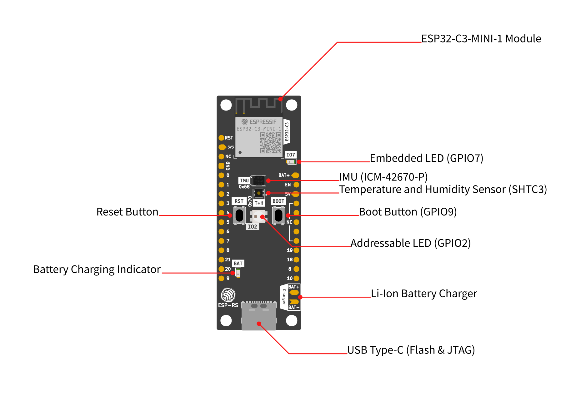
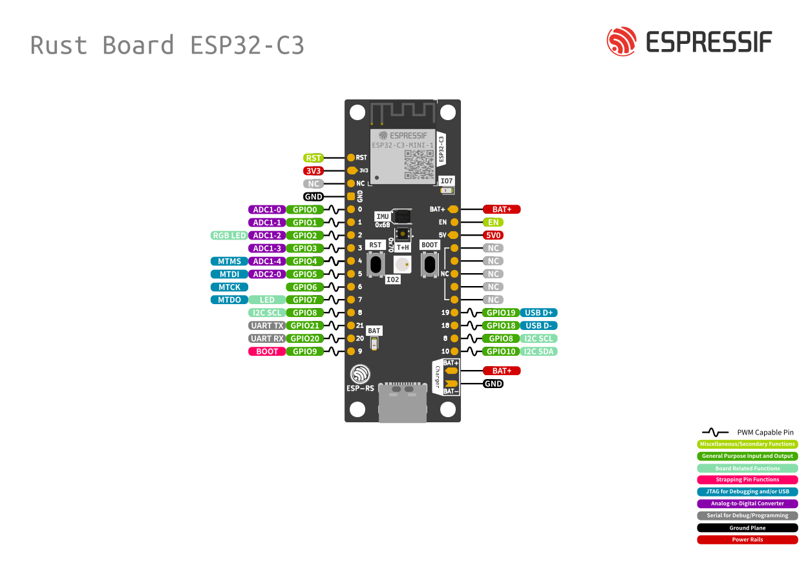
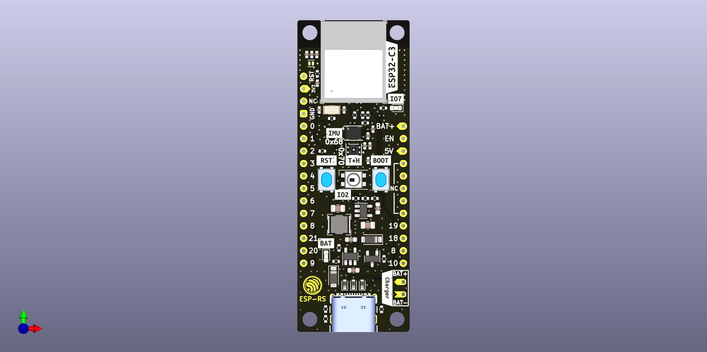
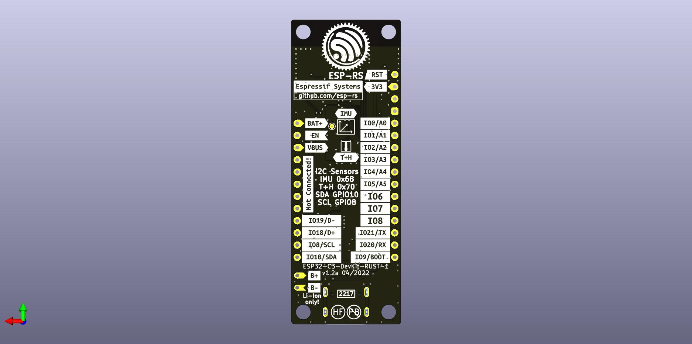

==================================================
Rust ESP 开发板
==================================================

:link_to_translation:`en:[English]`

Rust ESP 开发板项目提供自行制作该开发板所需的全部资料。

购买渠道
--------

* `ESP32-C3-DevKit-RUST-1 <https://www.espressif.com/en/products/devkits>`__
* `乐鑫官方 AliExpress 商店 <https://www.aliexpress.com/item/1005004418342288.html>`__
* `Mouser Electronics <https://www2.mouser.com/ProductDetail/Espressif-Systems/ESP32-C3-DevKit-RUST-1?qs=4ASt3YYao0WvXOj9TGjU2A%3D%3D>`__

  从英国以及部分欧洲地区通过 Mouser 订购时，结账后可能需要通过电子邮件填写并签署或传真出口申报表，处理时间会相应增加。

Ferrous Systems 培训
--------------------

* `培训书籍：Explore the power of Rust on the new Espressif board <https://github.com/esp-rs/std-training>`__

  * `培训材料 <https://esp-rs.github.io/std-training/>`__

项目规格
--------

该开发板基于 ESP32-C3，集成传感器、LED、按键、电池充电器和 USB Type-C 接口。

SoC 特性
~~~~~~~~

* 符合 IEEE 802.11 b/g/n
* Bluetooth 5 和 Bluetooth Mesh
* 32 位 RISC-V 单核处理器，最高 160 MHz
* 384 KB ROM
* 400 KB SRAM（其中 16 KB 用作缓存）
* 8 KB RTC SRAM
* 22 个可编程 GPIO
* 3 个 SPI
* 2 个 UART
* 1 个 I2C
* 1 个 I2S
* 2 个 54 位通用定时器
* 3 个看门狗定时器
* 1 个 52 位系统定时器
* 远程控制外设（RMT）
* LED PWM 控制器（LEDC）
* 全速 USB Serial/JTAG 控制器
* 通用 DMA 控制器（GDMA）
* 1 个 TWAI®
* 2 个 12 位 SAR ADC，最多 6 个通道
* 1 个温度传感器

完整规格请参阅 `ESP32-C3 数据手册 <https://www.espressif.com/sites/default/files/documentation/esp32-c3_datasheet_en.pdf>`__。

   开发板框图

I2C 外设
~~~~~~~~

该开发板通过 I2C 总线连接以下外设：

.. list-table::
   :header-rows: 1

   * - 外设
     - 器件型号
     - 参考资料
     - Create
     - 地址
   * - IMU
     - ICM-42670-P
     - `数据手册 <https://invensense.tdk.com/download-pdf/icm-42670-p-datasheet/>`__
     - `链接 <https://crates.io/crates/icm42670>`__
     - 0x68
   * - 温湿度
     - SHTC3
     - `数据手册 <https://www.mouser.com/datasheet/2/682/Sensirion_04202018_HT_DS_SHTC3_Preliminiary_D2-1323493.pdf>`__
     - `链接 <https://crates.io/crates/shtcx>`__
     - 0x70

I2C 总线连接
^^^^^^^^^^^^

.. list-table::
   :header-rows: 1

   * - 信号
     - GPIO
   * - SDA
     - GPIO10
   * - SCL
     - GPIO8

I/O
~~~

以下器件通过 GPIO 连接：

.. list-table::
   :header-rows: 1

   * - I/O 器件
     - GPIO
   * - WS2812 LED
     - GPIO2
   * - LED
     - GPIO7
   * - 按键/Boot
     - GPIO9

电源
~~~~

* USB Type-C（不兼容 PD）。
* 锂离子电池充电器 MCP73831T-2ACI/OT，最高充电电压为 4.2 V。

  * 建议：MCP73831T-2ACI/OT 不提供过流或过放保护。锂离子或锂聚合物电池应选用带保护电路的型号。
  * 限制：不支持读取电池电压。

引脚布局
--------

   引脚布局

左侧
~~~~

.. list-table::
   :header-rows: 1

   * - 引脚编号
     - 描述
     - SoC
   * - 1
     - Reset
     - EN/CHIP_PU
   * - 2
     - 3V3
     -
   * - 3
     - N/C
     -
   * - 4
     - GND
     -
   * - 5
     - IO0/ADC1-0
     - GPIO0
   * - 6
     - IO1/ADC1-1
     - GPIO1
   * - 7
     - IO2/ADC1-2
     - GPIO2
   * - 8
     - IO3/ADC1-3
     - GPIO3
   * - 9
     - IO4/ADC2-0
     - GPIO4
   * - 10
     - IO5/ADC2-1
     - GPIO5
   * - 11
     - IO6/MTCK
     - GPIO6
   * - 12
     - IO7/MTDO/LED
     - GPIO7
   * - 13
     - IO9/LOG
     - GPIO8
   * - 14
     - IO21/U0RXD
     - GPIO21
   * - 15
     - IO20/U0TXD
     - GPIO20
   * - 16
     - IO9/BOOT
     - GPIO9

右侧
~~~~

.. list-table::
   :header-rows: 1

   * - 引脚编号
     - 描述
     - SoC
   * - 1
     - VBAT
     -
   * - 2
     - EN [1]_
     -
   * - 3
     - VBUS [2]_
     -
   * - 4
     - NC
     -
   * - 5
     - NC
     -
   * - 6
     - NC
     -
   * - 7
     - NC
     -
   * - 8
     - NC
     -
   * - 9
     - IO18/USB_D-
     - GPIO18
   * - 10
     - IO19/USB_D+
     - GPIO19
   * - 11
     - IO8/SCL
     - GPIO8
   * - 12
     - IO10/SDA
     - GPIO10

.. [1] 连接至 LDO 使能引脚。
.. [2] 连接至 USB 5 V。

KiCad 项目库
------------

* `ESP32C3 <https://github.com/espressif/kicad-libraries>`__

开发板设计
----------

顶层
~~~~

   顶层

底层
~~~~

   底层

物料清单
--------

`交互式 BOM <https://esp-rs.github.io/esp-rust-board/>`__

外壳
----

`外壳 3D 打印模型 <https://www.printables.com/model/288200-minimalistic-case-for-esp32-c3-devkit-rust-1>`__
