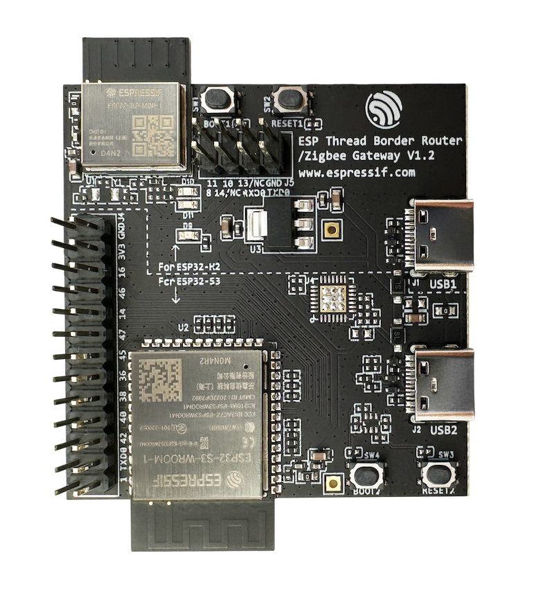
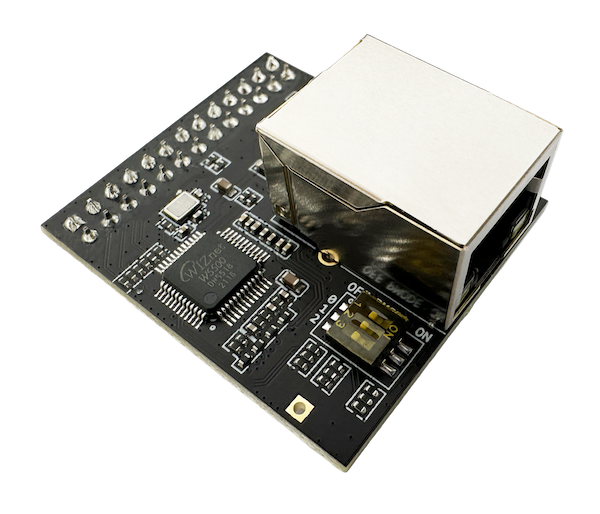

**************************************************
ESP Thread Border Router
**************************************************

:link_to_translation:`en:[English]`

乐鑫 Thread 边界路由器支持 Wi-Fi 和以太网接口作为骨干链路。

1.1. 基于 Wi-Fi 的 Thread 边界路由器
--------------------------------------

基于 Wi-Fi 的 ESP Thread 边界路由器由两个 SoC 组成：

   - Wi-Fi 主 SoC，可以使用 ESP32、ESP32-S 或 ESP32-C 系列 SoC。
   - 无线协处理器（RCP），使用 ESP32-H 系列 SoC。RCP 提供 IEEE 802.15.4 物理层和 MAC 层访问能力，使边界路由器能够接入 Thread 网络。

乐鑫提供了将主 SoC 和 RCP 集成到同一模块中的边界路由器开发板。

   ESP Thread Border Router/Zigbee 网关开发板

1.2. 基于以太网的 Thread 边界路由器
------------------------------------

基于以太网的 Thread 边界路由器与前述基于 Wi-Fi 的方案类似，但需要使用带以太网接口的设备。

乐鑫提供了以太网子板。该子板与 ESP Thread Border Router 开发板配合使用，可扩展以太网接口。

   ESP Thread Border Router/Zigbee 网关以太网子板

1.3. 包装和装箱
---------------

订购信息
^^^^^^^^

开发板提供多种硬件版本，具体信息如下表所示。

.. list-table::
   :header-rows: 1
   :widths: 31 30 7 7 25

   * - 订购代码
     - 板载模组
     - Flash [tbr-a]_
     - PSRAM
     - 描述

   * - ESP Thread BR-Zigbee GW
     - ESP32-S3-WROOM-1 和 ESP32-H2-MINI-1
     - 8 MB [tbr-b]_
     - 2 MB
     - ESP Thread Border Router/Zigbee 网关开发板
   * - ESP Thread BR-Zigbee GW_SUB
     -
     -
     -
     - ESP Thread Border Router/Zigbee 网关以太网子板

.. [tbr-a] Flash 集成在芯片封装中。
.. [tbr-b] 早期部分样品使用 4 MB Flash。

零售订购
^^^^^^^^

订购一个或多个样品时，每块开发板会单独包装。包装形式可能是防静电袋，也可能由零售商使用其他包装。

零售订购请访问 https://www.espressif.com/en/company/contact/buy-a-sample。

批量订购
^^^^^^^^

批量订购时，开发板会装在大型纸箱中。

批量订购请访问 https://www.espressif.com/en/contact-us/sales-questions。

1.4. 相关文档
--------------

1.4.1 原理图
^^^^^^^^^^^^

- `ESP Thread Border Router/Zigbee 网关开发板原理图 <https://dl.espressif.com/dl/schematics/esp_thread_br_zigbee_gw_schematics_v1.3.pdf>`_\ （PDF）
- `ESP Thread Border Router/Zigbee 网关以太网子板原理图 <https://dl.espressif.com/dl/schematics/esp_thread_br_zigbee_gw_sub_ethernet_schematiccs_v1.0.pdf>`_\ （PDF）

1.4.2 CAD 文件
^^^^^^^^^^^^^^

- `ESP Thread Border Router/Zigbee 网关开发板 CAD 文件 <https://dl.espressif.com/dl/schematics/ESP-Thread%20BR%26Zigbee%20GW_V1.zip>`_\ （ZIP）
- `ESP Thread Border Router/Zigbee 网关以太网子板 CAD 文件 <https://dl.espressif.com/dl/schematics/ESP-Thread%20BR%26Zigbee%20GW_Sub_Ethernet_V1.zip>`_\ （ZIP）
