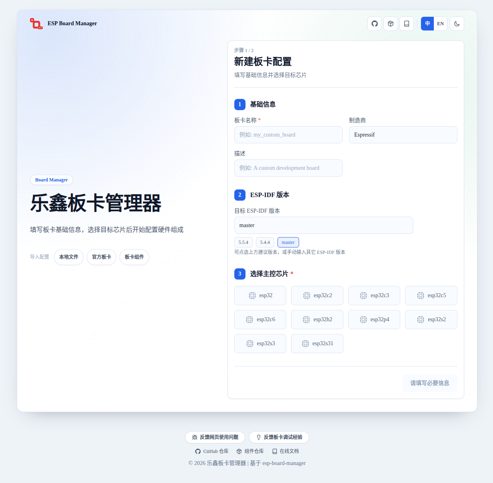

Board Manager 网页配置工具
========================================

:link_to_translation:`en:[English]`

Board Manager 网页配置工具支持新建板级配置、导入已有配置、编辑设备与外设参数并导出板级文件。使用网页创建开发板的具体步骤见 :doc:`/create-board/web-create`。

网页链接
----------------

乐鑫板卡管理器网页配置工具（https://board-manager.espressif.com ）

   Board Manager 网页配置工具主界面。

主要功能
----------------

- **新建板级配置**：填写开发板名称、制造商、描述、目标 ESP-IDF 版本和主控芯片，再选择需要的 device 与 peripheral。
- **导入已有配置**：支持导入本地板级目录、官方板卡和板卡组件，作为修改起点继续编辑。
- **编辑配置参数**：按配置卡片填写模式字段、引脚参数、待确认参数、外设依赖和组件依赖。
- **导出板级文件**：导出 ``board_info.yaml``、``board_devices.yaml`` 和 ``board_peripherals.yaml``；需要板级初始化逻辑时还会附带 ``setup_device.c``。
- **配置校验**：检查芯片能力冲突并提示 IO 引脚复用问题，帮助在导出前发现明显错误。

适用范围
----------------

网页工具面向 BMGR 已支持的设备和外设类型，适合作为新建开发板配置的入口。完成配置后能够一键导出下列文件：

- ``board_info.yaml``
- ``board_devices.yaml``
- ``board_peripherals.yaml``
- ``setup_device.c``

其中 ``setup_device.c`` 只有在所选设备需要纯 YAML 无法描述的板级初始化逻辑（如显示屏工厂函数）时才会生成。

使用边界
----------------

- 工具只生成板级配置文件，不替代 ``idf.py bmgr`` 命令。导出的 YAML 仍需放入工程并执行 ``idf.py bmgr -b`` 生成板级代码。
- 工具不生成 ``sdkconfig.defaults.board``，目标芯片和工程配置仍需在 ESP-IDF 工程中按常规方式设置。
- 导出的 ``setup_device.c`` 只是按工厂函数接口生成的代码模板，需要结合实际硬件补全初始化逻辑并在板上调试通过，不能直接使用。
- 板级参数中的引脚号、地址、时钟、时序和供电关系仍需对照原理图与器件资料确认。

反馈入口
----------------

首页底部提供两个反馈入口：

- **反馈网页使用问题**：反馈网页工具本身的使用问题，入口为 https://board-manager.espressif.com/debug-collector/feedback 。
- **反馈板卡调试经验**：提交开发板适配与调试过程中的经验，入口为 https://board-manager.espressif.com/debug-collector/board-tips 。
